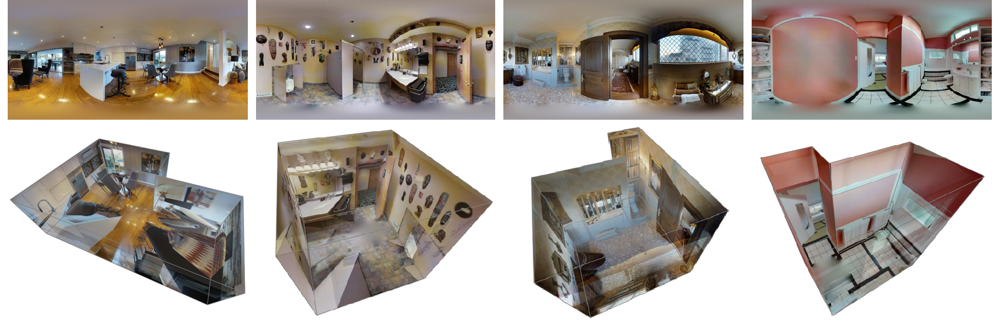

## LayoutMP3D

LayoutMP3D is a 3D layout Dataset from a subset of Matterport3D. 
Matterport3D contains accurate depth ground truth from time-of-flight(ToF) sensors, 
our dataset can provide both layout and depth information.
Here we release our layout annotation with Manhattan assumption.
## How to use
### Get Alignment Matterport3D Data
+ Step1: Download [Matterport3D](https://github.com/niessner/Matterport) Official Dataset
+ Step2: Stitch Matterport3D data into an Equirectangular [link](https://github.com/yindaz/PanoBasic)
+ Step3: Pre-processing and Calibrating Equirectangular Data (Align camera pose with floor) by using [pytorch-layoutnet](https://github.com/sunset1995/pytorch-layoutnet)
### Load our annotation
We provide our layout annotation and split list in [LayoutMP3D](https://drive.google.com/file/d/1sXWz3s2H46YVP3J218vvBqBxWvWKVYlE/view?usp=sharing), which is a ```.zip``` file consisting of a layout label folder and two data split ```.txt``` file </br>

```
LayoutMp3D     
└─── layout_label_all
    │   1LXtFkjw3qL_4b77e304d83943999198c3cd4457512c.json
    │   1LXtFkjw3qL_7b99fad7a2b243dea6b50dc65d03fbc7.json
    │   ...
    │   zsNo4HB9uLZ_faad06c7cb2b4a6f9220e7f6f87c800b.json
└─── train_new.txt
└─── val_new.txt
```

- **layout_label_all** contains 2502 json file with layout annotation in total. </br>
- **train_new.txt** contains 1878 training samples and **val_new.txt** contains 463 testing samples. We remove some invalid cases. Hence, there are 2341 samples in total.

We save our layout label with json file which contain layout information with corner points, plane equation and layout height. In addition, we set the distance between camera and floor to 1.6, then we can get layout height. Here I take a four corner layout label as an example to illustrate our label format.
```json
{
    "cameraCeilingHeight": 0.7278137969970699, "the distance between camera and ceiling"
    "cameraHeight": 1.6,                       "we fix cameraHeight, the distance between camera and floor, to 1.6"
    "layoutHeight": 2.32781379699707,          "the distance between floor and ceiling in terms of our layout height"
    "layoutObj2ds": {
        "num": 0,
        "obj2ds": []
    },
    "layoutPoints": {                          "the corner label, containing 2D points： coords and 3D points： xyz "
        "num": 4,                              "corner number"
        "points": [                            "points contain 2D pixel coordinate and 3D xyz coordinate"
            {
                "coords": [                    "uv coordinate on Panorama image" 
                    0.6980483667513767,        "u value"
                    0.5                        "v value"
                ],
                "id": 43755,                   "corner id, first corner point in this case"
                "xyz": [                       "3D coordinate"
                    2.3409475904063037,        "x value"
                    0.0,                       "y value"
                    -0.7924848973190416        "z value"
                ]
            },
            {
                "coords": [
                    0.7809959450607358,
                    0.5 
                ],
                "id": 43756,                   "corner id, second corner point in this case"
                "xyz": [
                    2.3409475904063037,
                    0.0,
                    0.46176001199947475
                ]
            },
            {
                "coords": [
                    0.1804518329068442,
                    0.5
                ],
                "id": 43757,                   "corner id, third corner point in this case"
                "xyz": [
                    -0.9885649959660757,
                    0.0,
                    0.46176001199947475
                ]
            },
            {
                "coords": [
                    0.3575485261415249,
                    0.5 
                ],
                "id": 43758,                   "corner id, fourth corner point in this case"
                "xyz": [
                    -0.9885649959660757,
                    0.0,
                    -0.7924848973190416
                ]
            }   
        ]   
    },
    "layoutWalls": {                           "palne equation represent each walls"
        "num": 4,                              "wall number"
        "walls": [
            {
                "id": 143,                     "wall id, first wall equation in this case"
                "normal": [                    "palne normal"
                    1.0,
                    0.0,
                    -0.0
                ],
                "planeEquation": [             "plane equation, ax+by+cz+d=0"
                    1.0,                       "a"
                    0.0,                       "b"
                    -0.0,                      "c"
                    -2.3409475904063037        "d"
                ],
                "pointsIdx": [                 "point 0 and point 1 composed of the first wall"
                    0,
                    1
                ],
                "width": 1.2542449093185164    "wall width"
            },
            {
                "id": 144,                     "wall id, second wall equation in this case"
                "normal": [
                    0.0,
                    0.0,
                    1.0
                ],
                "planeEquation": [
                    0.0,
                    0.0,
                    1.0,
                    -0.46176001199947475
                ],
                "pointsIdx": [
                    1,
                    2
                ],
                "width": 3.3295125863723793
            },
            {
                "id": 145,                     "wall id, third wall equation in this case"
                "normal": [
                    -1.0,
                    -0.0,
                    -0.0
                ],
                "planeEquation": [
                    -1.0,
                    -0.0,
                    -0.0,
                    -0.9885649959660757
                ],
                "pointsIdx": [
                    2,
                    3
                ],
                "width": 1.2542449093185164
            },
            {
                "id": 146,                     "wall id, fourth wall equation in this case"
                "normal": [
                    0.0,
                    0.0,
                    -1.0
                ],
                "planeEquation": [
                    0.0,
                    0.0,
                    -1.0,
                    -0.7924848973190416
                ],
                "pointsIdx": [
                    3,
                    0
                ],
                "width": 3.3295125863723793
            }
        ]
    }

```
<!--
We save our layout label with json file; layout information with latitude and longitude coordinate.
The format size is (12, 2), if corner number less than 12, we concatenate **inf** to make the size become 12.
-->
## Citation
@misc{2003.13516, </br>
Author = {Fu-En Wang and Yu-Hsuan Yeh and Min Sun and Wei-Chen Chiu and Yi-Hsuan Tsai}, </br>
Title = {LayoutMP3D: Layout Annotation of Matterport3D}, </br>
Year = {2020}, </br>
Eprint = {arXiv:2003.13516}, </br>
}
